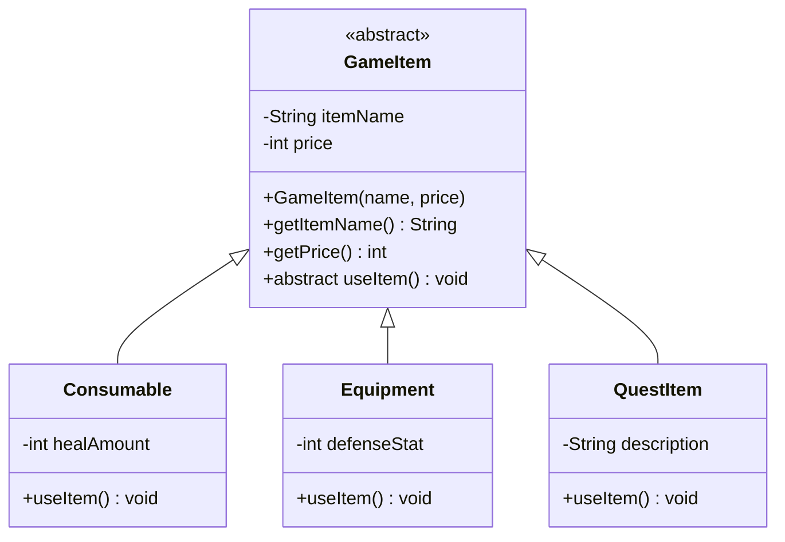
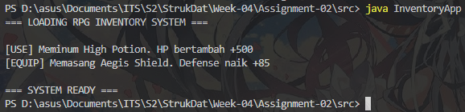

# Class Diagram

## 1. Deskripsi Kasus
Dalam pengembangan game RPG, para player seringkali memiliki berbagai jenis item di dalam *inventory* mereka, seperti potion (*Consumable*), weapon (*Equipment*), hingga item misi (*Quest Item*). 

**Permasalahan:** Jika dikelola secara manual, sistem akan membutuhkan banyak pengecekan `if-else` yang rumit, panjang, dan lama hanta untuk menentukan aksi setiap item. 
**Solusi OOP:** Dengan paradigma OOP, kita memperlakukan semua benda sebagai objek `GameItem`. Melalui **Polimorfisme**, kita cukup memanggil satu fungsi `useItem()`, dan program secara otomatis akan menjalankan aksi yang sesuai (meminum, memasang, atau membaca) tanpa perlu pengecekan manual yang berbelit.

---

## 2. Class Diagram (Mermaid)



---

## 3. Kode Program Java

### GameItem.java (Abstraction & Encapsulation)
```java
public abstract class GameItem {
    private String itemName;
    private int price;

    public GameItem(String itemName, int price) {
        this.itemName = itemName;
        this.price = price;
    }

    // Encapsulation: Akses data melalui Getter
    public String getItemName() { return itemName; }
    public int getPrice() { return price; }

    // Abstraction: Definisi fungsi tanpa implementasi detail
    public abstract void useItem();
}
```

### Consumable.java (Inheritance & Polymorphism)
```java
public class Consumable extends GameItem {
    private int healAmount;

    public Consumable(String name, int price, int heal) {
        super(name, price);
        this.healAmount = heal;
    }

    @Override
    public void useItem() {
        System.out.println("[USE] Meminum " + getItemName() + ". HP bertambah +" + healAmount);
    }
}
```

### Equipment.java (Inheritance & Polymorphism)
```java
public class Equipment extends GameItem {
    private int defenseStat;

    public Equipment(String name, int price, int def) {
        super(name, price);
        this.defenseStat = def;
    }

    @Override
    public void useItem() {
        System.out.println("[EQUIP] Memasang " + getItemName() + ". Defense naik +" + defenseStat);
    }
}
```

### InventoryApp.java (Program yang Harus di-Run)
```java
public class InventoryApp {
    public static void main(String[] args) {
        System.out.println("=== LOADING RPG INVENTORY SYSTEM ===\n");

        // Polymorphism: Berbagai subclass disimpan dalam tipe referensi Parent
        GameItem slot1 = new Consumable("High Potion", 150, 500);
        GameItem slot2 = new Equipment("Aegis Shield", 2500, 85);

        slot1.useItem();
        slot2.useItem();

        System.out.println("\n=== SYSTEM READY ===");
    }
}
```

---
## 4. Screenshot Output

### Output Kode Java


---

## 5. Penjelasan Prinsip OOP

1.  **Abstraksi (Abstraction):** Digunakan pada kelas `GameItem`. Kita tidak bisa menciptakan objek "Item" secara langsung karena item harus memiliki jenis yang jelas.
2.  **Enkapsulasi (Encapsulation):** Variabel `itemName` dan `price` bersifat `private`. Hal ini mencegah perubahan harga item secara ilegal dari luar sistem inventory.
3.  **Pewarisan (Inheritance):** Kelas `Consumable` dan `Equipment` mewarisi seluruh atribut dari `GameItem`, sehingga kode lebih terstruktur dan tidak redundan.
4.  **Polimorfisme (Polymorphism):** Metode `useItem()` dipanggil dengan cara yang sama, namun menghasilkan perilaku berbeda sesuai dengan tipe objeknya (satu instruksi, banyak bentuk).

---

## 6. Keunikan Program
Berbeda dengan sistem manajemen umum (seperti perpustakaan), program ini menonjolkan:
* **Domain RPG:** Menggunakan logika *item mall* dan *inventory slot* yang spesifik untuk gamers.
* **Modularitas:** Penambahan kategori item baru (seperti *QuestItem* atau *MagicScroll*) dapat dilakukan dengan sangat mudah tanpa merusak kode utama.
* **Terminologi Spesifik:** Menggunakan istilah teknis game seperti `healAmount`, `defenseStat`, dan `Equip Action`.